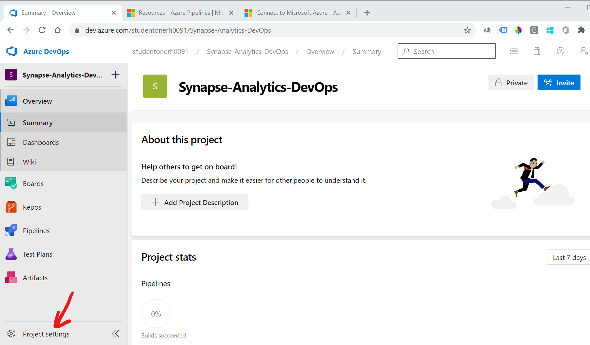
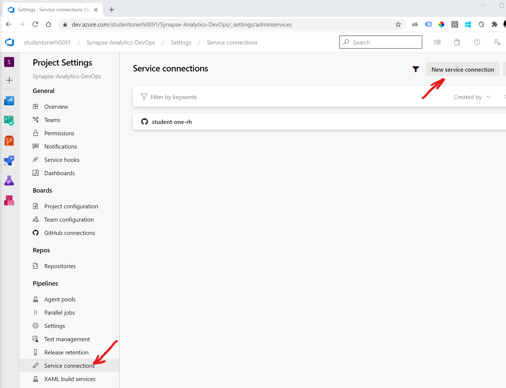
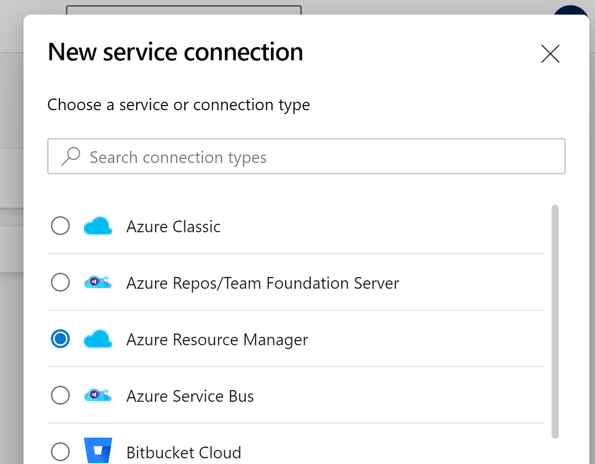
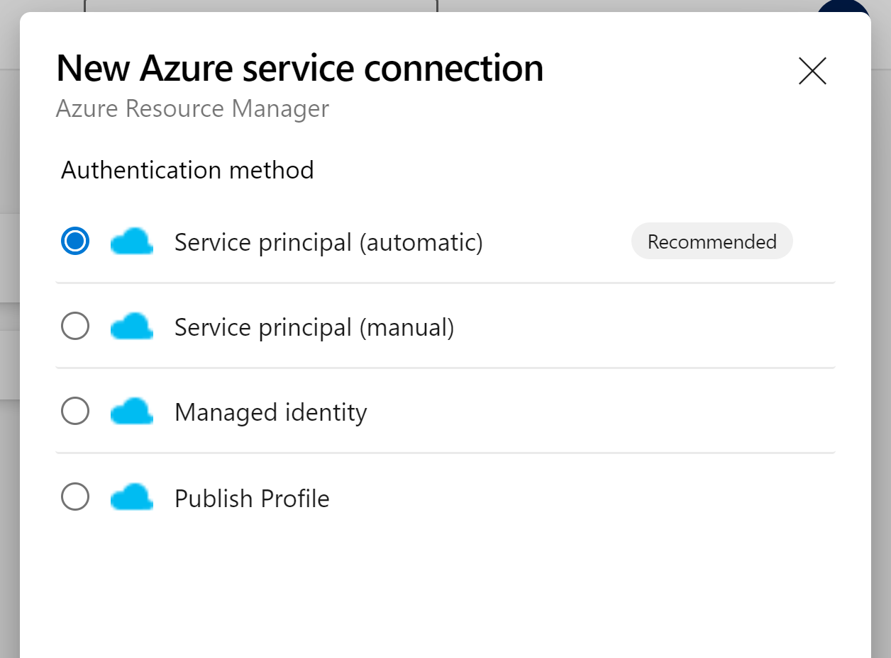
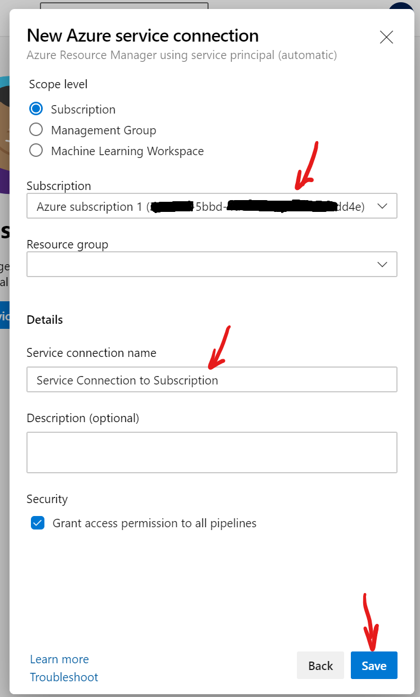
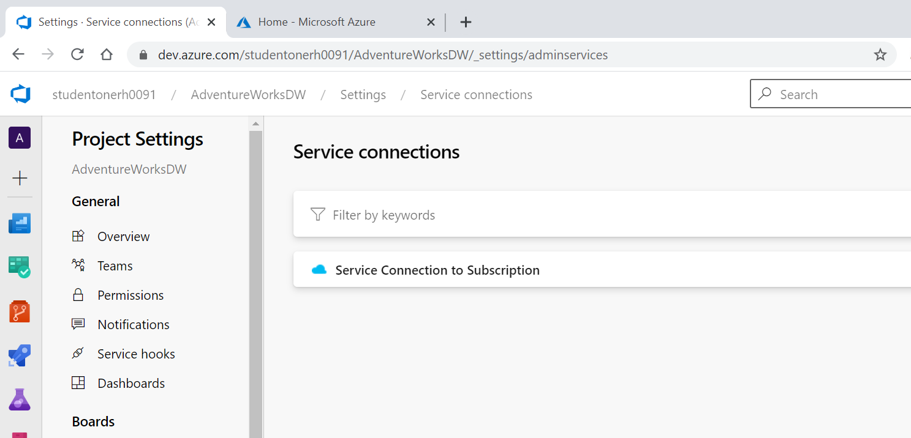

Creatting a Service link will authorize an Azure Pipeline to create resources and deploy schema to your subscription. Please follow the steps below:

1. With your project selected in Azure DevOps, click on Settings on the lower left of your screen.

Now click on "Service Connections" then click "New Service Connection"

Creatting a Service link will authorize an Azure Pipeline to create resources and deploy schema to your subscription. Please follow the steps below:

1. With your project selected in Azure DevOps, click on Settings on the lower left of your screen.

Now click on "Service Connections" then click "New Service Connection"

Select "Azure Resource Manager"

Select "Service Principal (automatic)"

Select your subscription from the drop down list and type a name for your new Azure Service Connection, then click "Save". In the example below, the name of the service connection is "Service Connection to Subscription". This name must be referenced on the YAML pipeline, so make a note of it if you use a different name.

After the Service Connection is created you should see the following:

