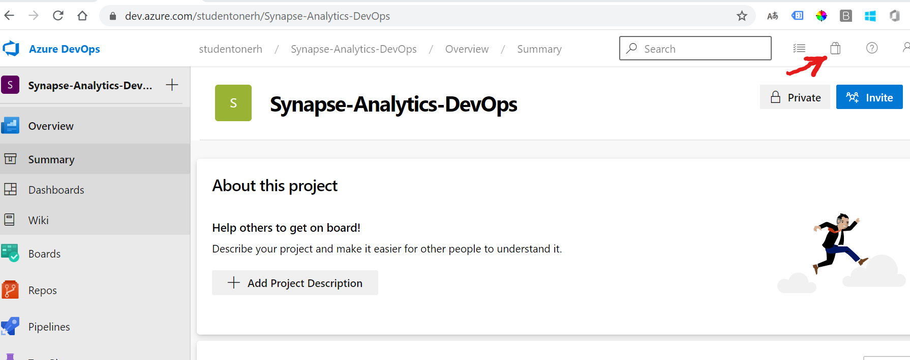
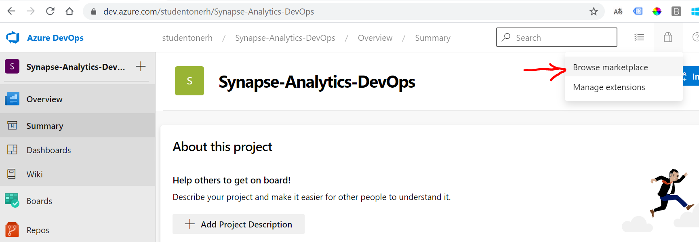
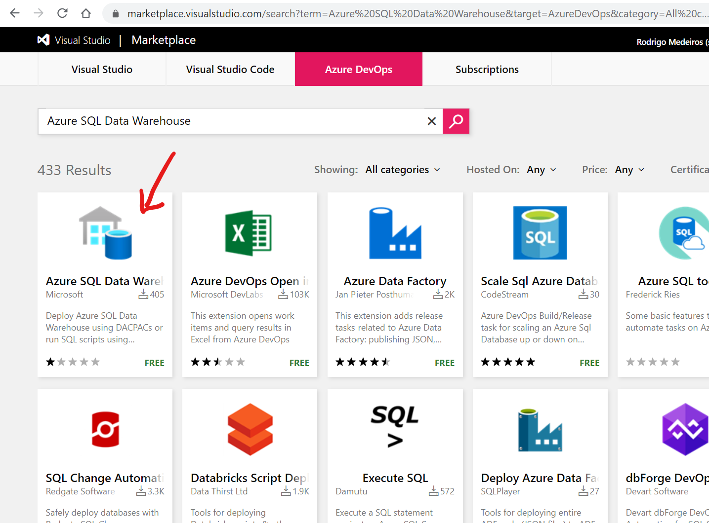
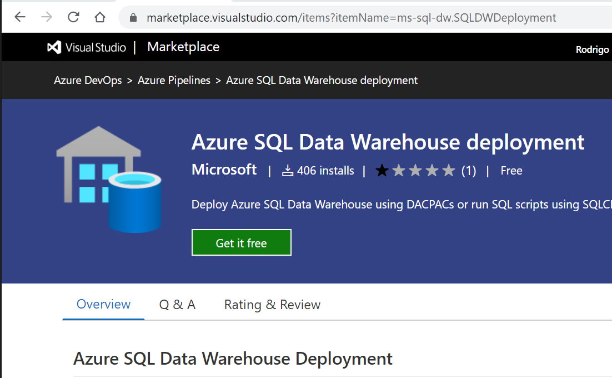
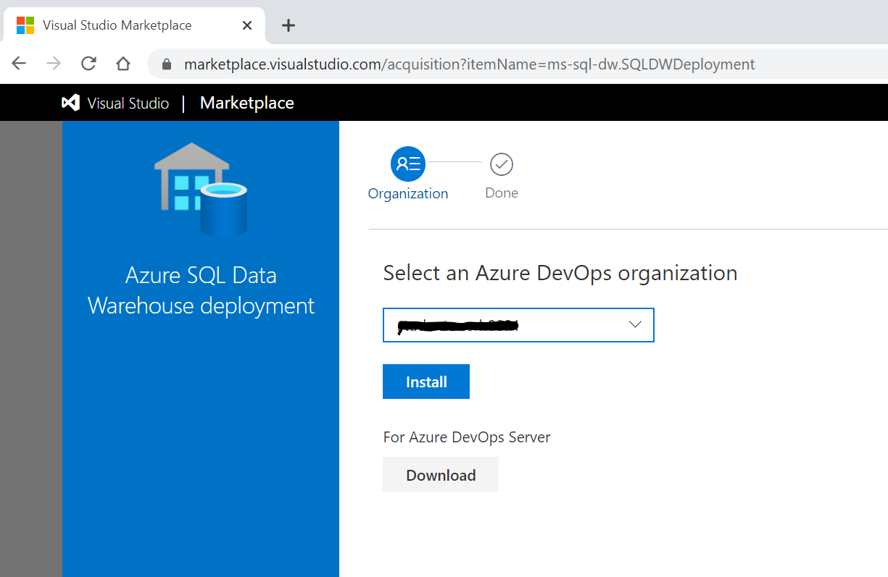
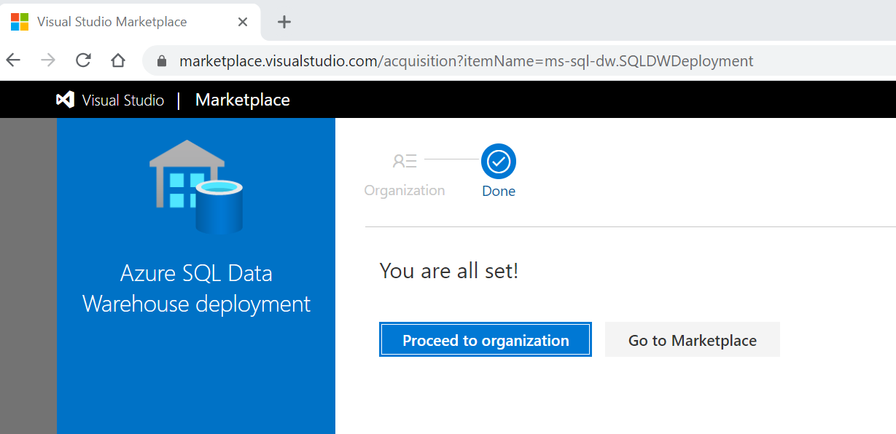

Steps to add the Azure SQL Data Warehouse deployment extension.

1. Navigate to your project in Azure DevOps, then click on the shopping bag icoon on the top right of the screen.

2. Select "Browse Marketplace"

3. Search for "Azure SQL Data Warehouse"

4. Click the green button "Get if free"

Select your organization on the drop down list. You might not see your DevOps Organization if you recently linked it to your Azure Active Directory. To work around this issue, close all browser windows and log in again to Azure DevOps, then start again from step 1 above.

After selecting your organization, click "Install" to install the SQL DW extension to Azure DevOps.

You will know that the installation was successful if you see the message below:

