# Synapse-Analytics-DevOps
Sample build and release pipelines to automate schema change releases with SQL Synapse SQL Pools (formery SQL DW). Using a YAML pipeline with three stages: (1) Build (2) Deploy to a Development environment and (3) Deploy to a QA environment.

To get it working on your environment, follow the steps below.
## Pre-requisites

In summary you will need an Azure Subscription, a GitHub Account, an Azure DevOps account, your own copy of this repo, and an Azure DevOps Project. The steps for pre-requisite setup: 

1. [Sign up or Sign](https://docs.microsoft.com/en-us/learn/modules/create-an-azure-account/) in to [Azure](http://portal.azure.com), make sure you have at least one Subscription under "Subscriptions".  
2. [Sign up](https://help.github.com/en/github/getting-started-with-github/signing-up-for-a-new-github-account) or sign in to GitHub. 
3. Make sure you are signed in to your GitHub account, then go to https://github.com/rodrigo-m/Synapse-Analytics-DevOps (this repo) and click "Fork" on the top right to [create a copy of this repository](https://guides.github.com/activities/forking/) in your account.  
4. [Sign up or sign in to Azure DevOps](https://docs.microsoft.com/en-us/azure/devops/user-guide/sign-up-invite-teammates?view=azure-devops).
5. Make sure your DevOps Organization is linked to your Azure Active Directory. See details [here](https://docs.microsoft.com/en-us/azure/devops/organizations/accounts/connect-organization-to-azure-ad?view=azure-devops#connect-your-organization-to-azure-ad).
6. [Create a project](https://docs.microsoft.com/en-us/azure/devops/organizations/projects/create-project?view=azure-devops&tabs=preview-page) in Azure DevOps. Select Git as your source control on step 3 (or under Advanced). 
7. Import the [Azure SQL Data Warehouse deployment](https://marketplace.visualstudio.com/items?itemName=ms-sql-dw.SQLDWDeployment) extension. For step-by-step instructions [click here](./InstallDwDeploymentExtension.md). 
8. In your AzureDevOps Project Settings, create a service connection to your Subscription. Step-by-step instructions [here](./AddServiceConnection.md).

## Create a Pipeline (YAML) to Build and Deploy

In this section you will create a pipeline and reference the GitHub repository you forked.

Open your Azure DevOps project, select Pipelines under Pipelines, then click "Create Pipeline"

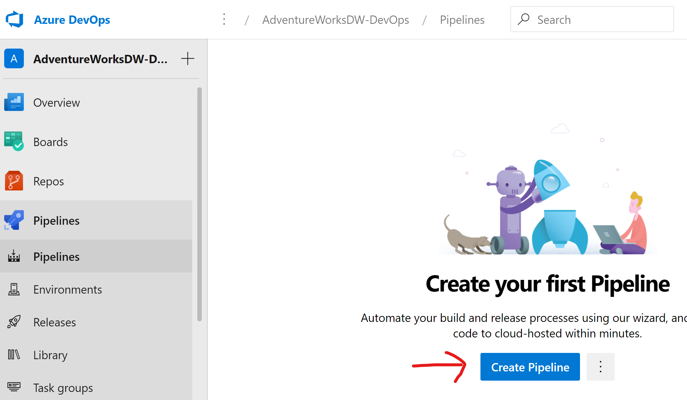

Select Github 

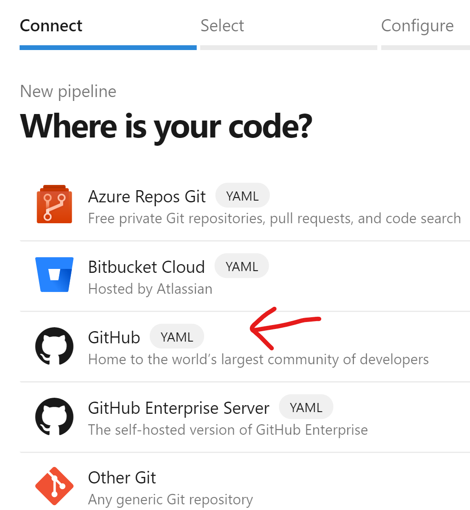

Click the green button "Authorize AzurePipelines"

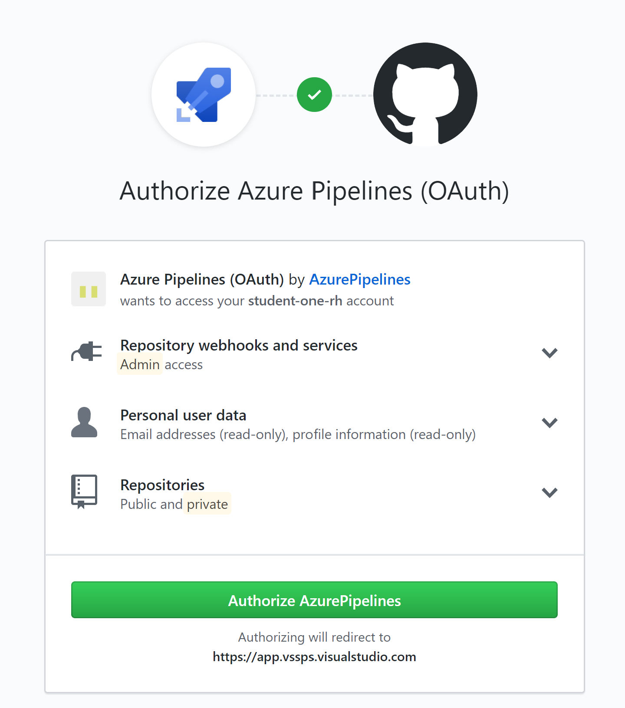

Select the repository you forked earlier: 

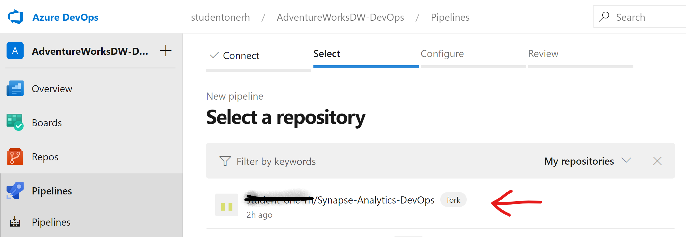

Click Approve & Install

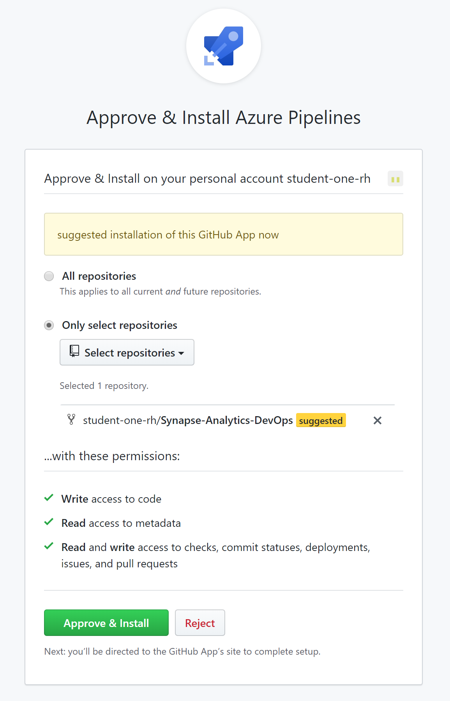

You may be required to select your AzureDevOps account, and after this you will land back on "Review your Pipeline" within your Azure DevOps project.This is a YAML pipeline. 

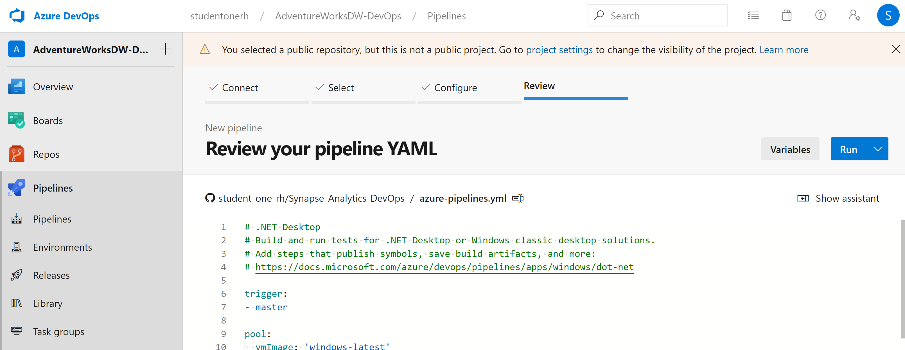

Note that Azure DevOps recognized the standard name "azure-pipelines.yml" at the root of the repo. This file has a pipeline that essentially builds the database project, publishes the output and scripts to an area called "drop", then deploys the solution and dependent resources to dev and QA ennvironments. The collection of files produced by this pipeline, or artifacts, are referenced in later stages of the pipeline.  

Note that you have several parameters at the beginning of the pipeline. Parameter values can be adjusted when you run the pipeline.

Replace the value '<Your Subscription Name and ID>' with the subscription name and ID that you wish the deploy resorces to then click "Save and Run" on the top right.

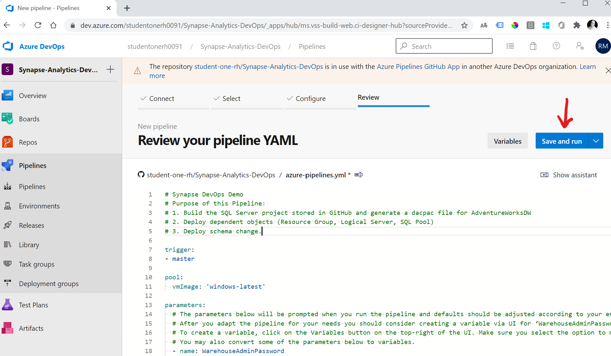

Make sure your pipeline run is successful before you proceed: 

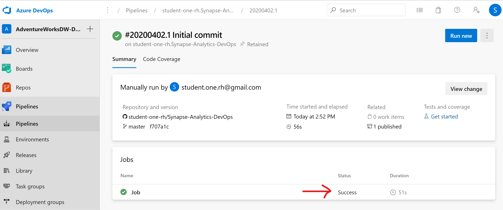

## Clone the repository to your local machine

To start, go to the GitHub Repository you forked, click on the green button "Clone or Download" then copy the URL of the forked repository:

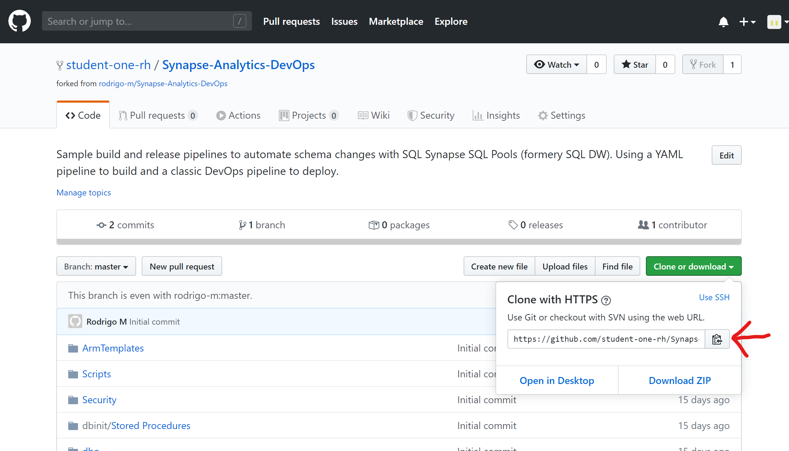

Now open Visual Studio. Skip the welcome screen by clicking "Continue Without Code" in the lower right portion of the screen if applicable. 

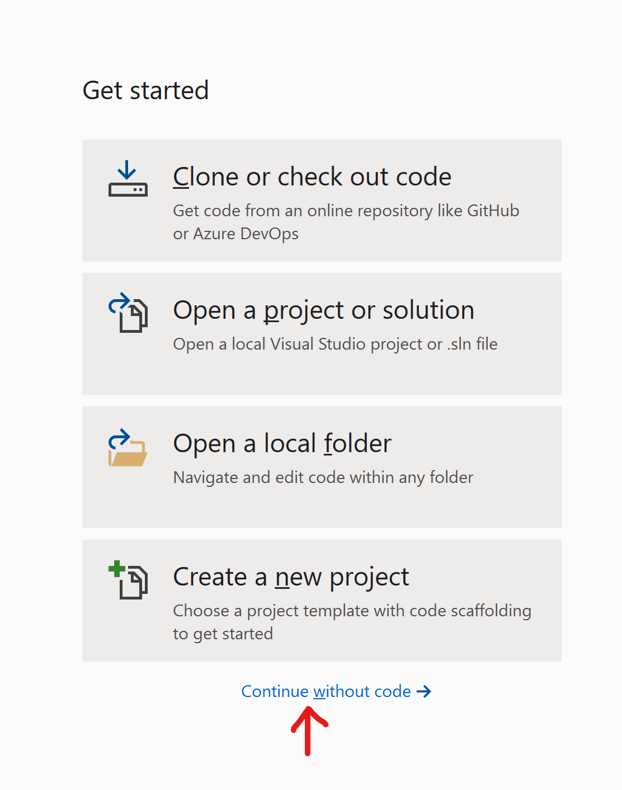

On the top right area of the screen, click the green plug to "Manage Connections"

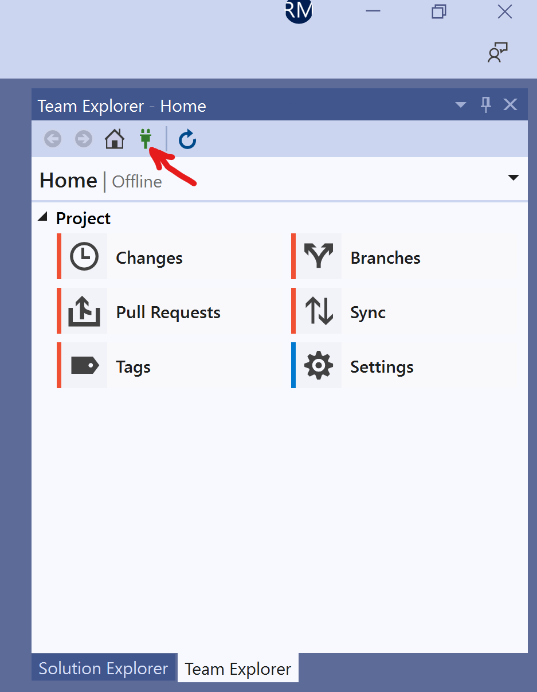

Under "Local Git Repositories" click "Clone", then paste the URL of the repository you forked and select the local folder where the local repo will live. 

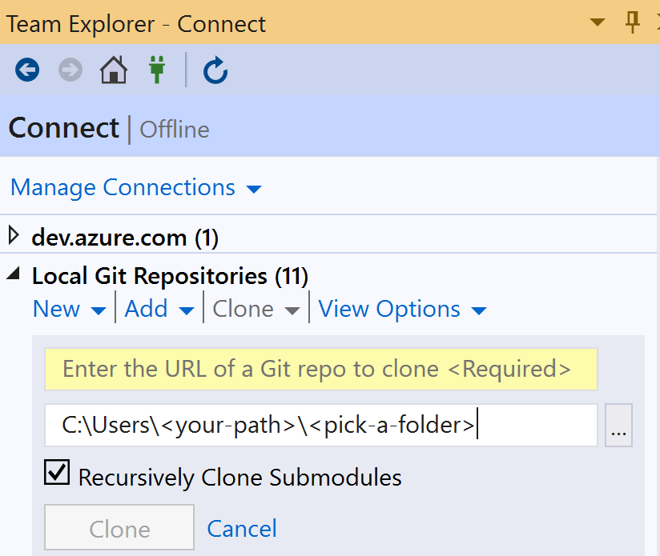

After a copy of the repository is downloaded to your machine, you can open the AdventureWorksDW solution by double-clicking AdventureWorksDW.sln

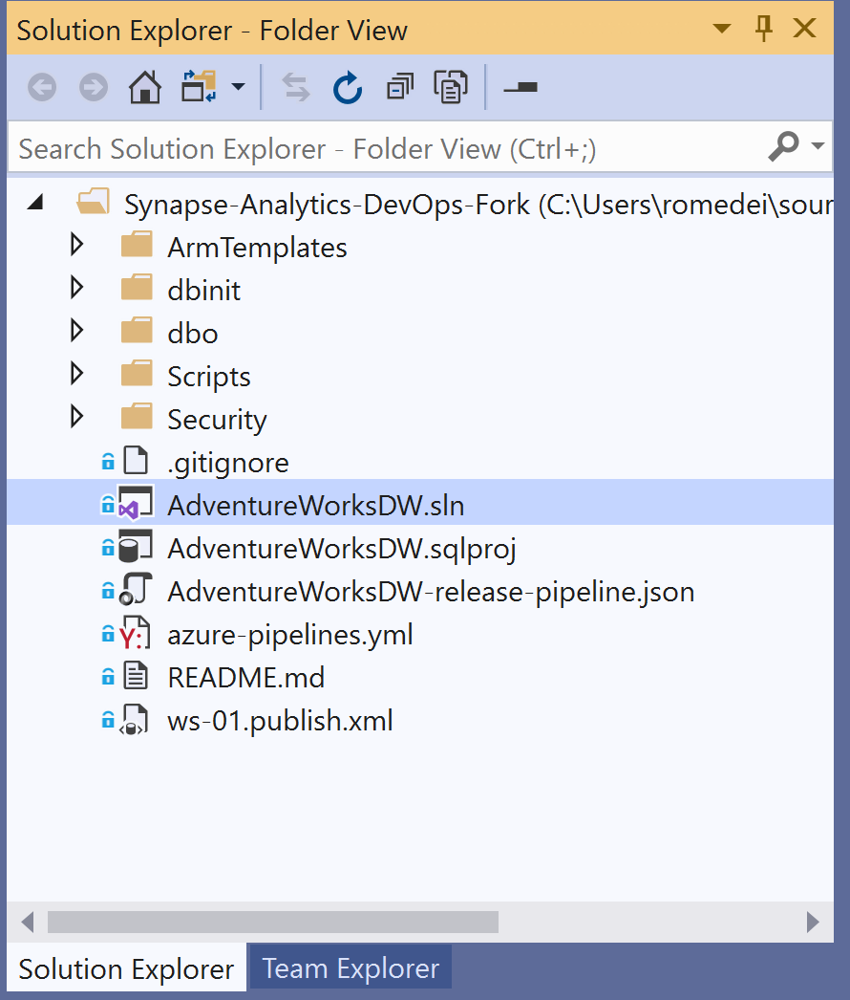

Now select "Build" then "Build Solution" on the top menu and confirm that you can build your solution locally:

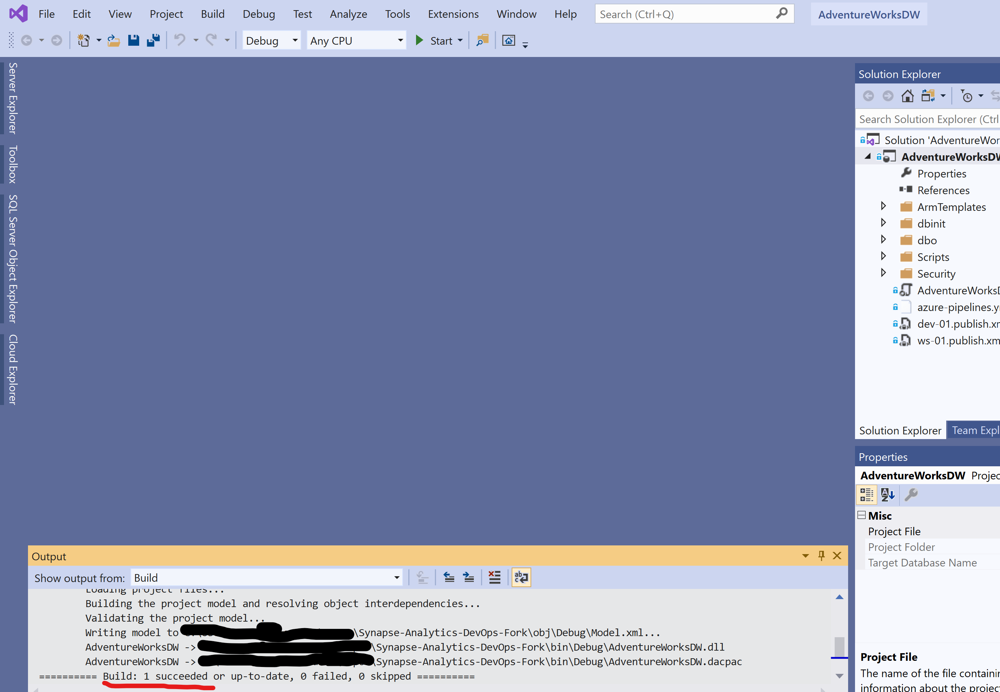

Your setup is complete.

After making modifications to database objects in Visual Studio, pushing changes to Git will trigger the YAML pipeline you created above.

