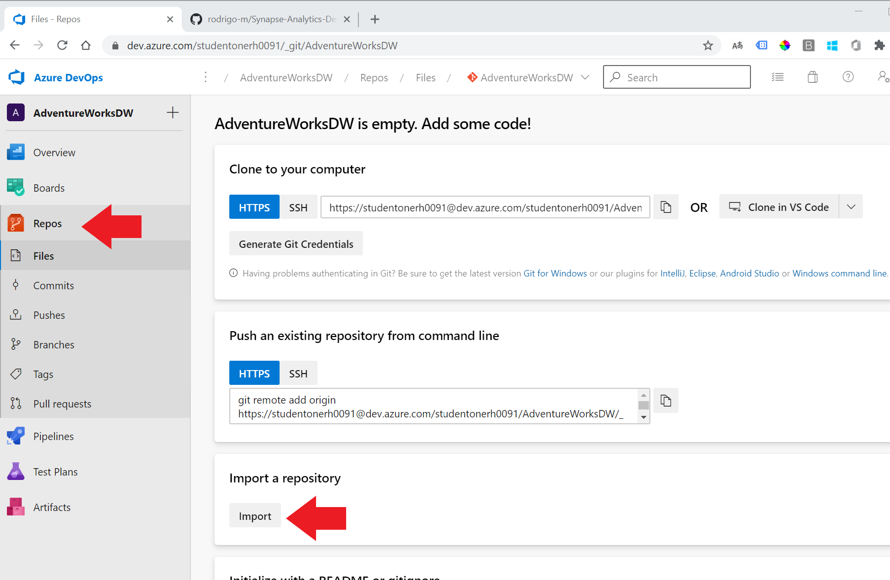
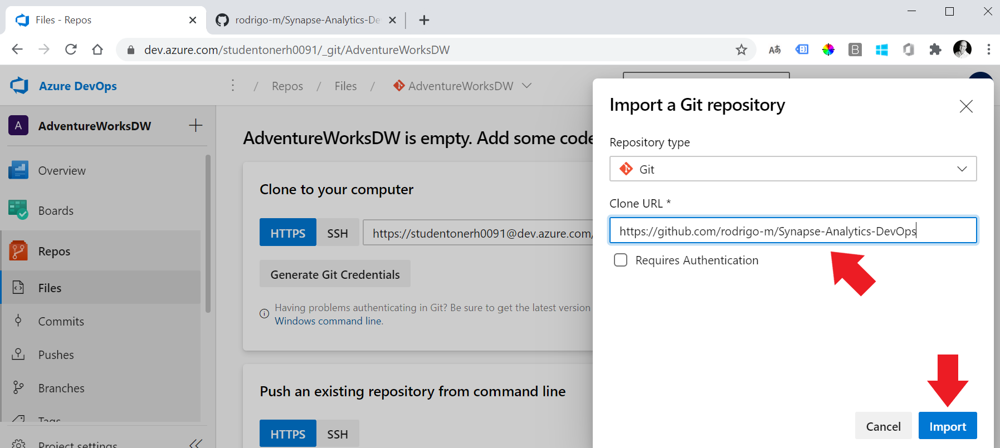
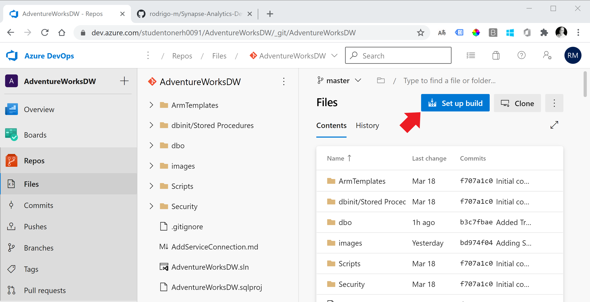
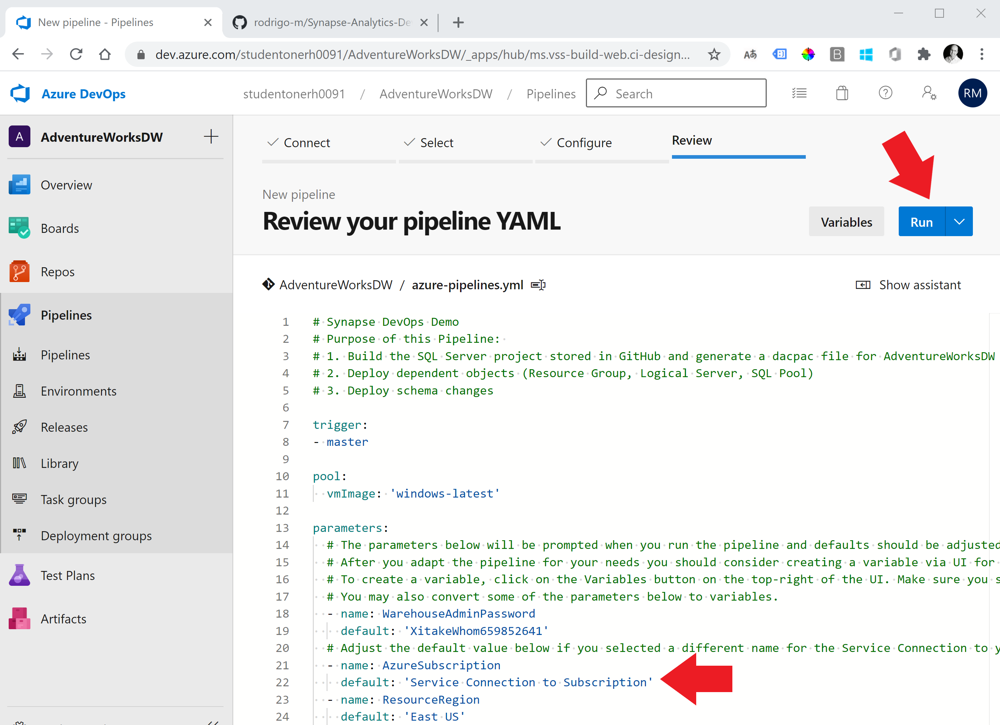
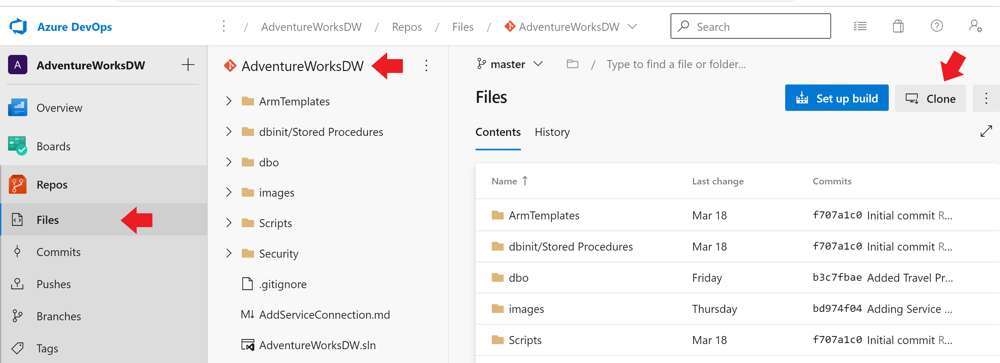
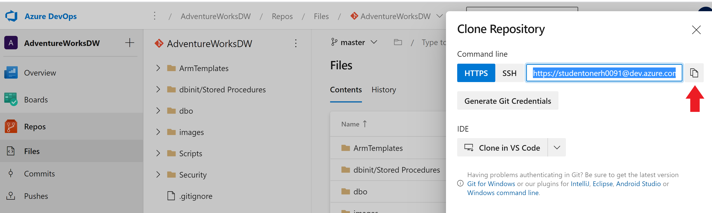

# Synapse-Analytics-DevOps
Sample build and release pipelines to automate schema change releases with SQL Synapse SQL Pools (formery SQL DW). Using a YAML pipeline with three stages: (1) Build (2) Deploy to a Development environment and (3) Deploy to a QA environment.

To get it working on your environment, follow the steps below.
# Pre-requisites

In summary you will need an Azure Subscription, an Azure DevOps account, and an Azure DevOps Project. The steps to setup pre-requisites: 

1. [Sign up or Sign](https://docs.microsoft.com/en-us/learn/modules/create-an-azure-account/) in to [Azure](http://portal.azure.com), make sure you have at least one Subscription under "Subscriptions".  
2. [Sign up or sign in to Azure DevOps](https://docs.microsoft.com/en-us/azure/devops/user-guide/sign-up-invite-teammates?view=azure-devops).
4. Make sure your DevOps Organization is linked to your Azure Active Directory. See details [here](https://docs.microsoft.com/en-us/azure/devops/organizations/accounts/connect-organization-to-azure-ad?view=azure-devops#connect-your-organization-to-azure-ad).
5. [Create a project](https://docs.microsoft.com/en-us/azure/devops/organizations/projects/create-project?view=azure-devops&tabs=preview-page) in Azure DevOps. Select Git as your source control on step 3 (or under Advanced). 
6. Import the [Azure SQL Data Warehouse deployment](https://marketplace.visualstudio.com/items?itemName=ms-sql-dw.SQLDWDeployment) extension. For step-by-step instructions [click here](./InstallDwDeploymentExtension.md). 
7. In your AzureDevOps Project Settings, create a service connection to your Subscription. Step-by-step instructions [here](./AddServiceConnection.md).

# Setup

## Import GitHub repo into the project's Azure Git Repo

Navigate to your project, select "Repos" from the left menu, then select "Import".

Paste the URL of this GitHub Repo "https://github.com/rodrigo-m/Synapse-Analytics-DevOps" on the field "Clone URL", then click "Import"

## Create a Pipeline (YAML) to Build and Deploy

Once the import process is complete you will see files imported from GitHub under Repos/Files. Click on "Setup Build" on the upper right corner to create a pipeline to build and deploy the project:

Azure DevOps recognized the standard name "azure-pipelines.yml" at the root of the repo you just imported and show it in Edit mode. Make sure the Default Value under "AzureSubscription" match the name of the Service Connetion you have created earlier, then click "Run" on the top right corner. The button will read "Save and Run" if you edited the pipeline.

Make sure your pipeline run is successful before you proceed: 

## Clone the repository to your local machine

Use the left menu to navigate to Repos/Files, make sure the Repo you created for AdventureWorksDW is selected, then click "Clone" on the top right of the screen.

Now click the Copy icon to copy the URL for the Git Repository:

Now open Visual Studio. Skip the welcome screen by clicking "Continue Without Code" in the lower right portion of the screen if applicable. 

On the top right area of the screen, click the green plug to "Manage Connections"

Under "Local Git Repositories" click "Clone", then paste the URL of the repository you forked and select the local folder where the local repo will live. 

After a copy of the repository is downloaded to your machine, you can open the AdventureWorksDW solution by double-clicking AdventureWorksDW.sln

Now select "Build" then "Build Solution" on the top menu and confirm that you can build your solution locally:

Your setup is complete.

After making modifications to database objects in Visual Studio, pushing changes to Git will trigger the YAML pipeline you created above.

